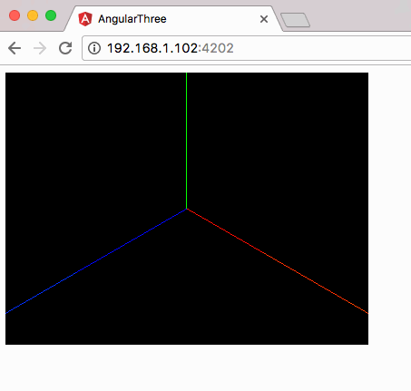

##### [generate a new project](https://github.com/u4bi/simple-angular-threejs/commit/882a08518888023067632c61969bfb318aad4b78)
```
ng new angular-three
cd angular-three
```
##### [npm install : three](https://github.com/u4bi/simple-angular-threejs/commit/99b0d6b49b2f249a7ed65293102d3ab4b957e5e0)
```
npm install --save three
```

##### [npm install : @types/three](https://github.com/u4bi/simple-angular-threejs/commit/f3b0158dd32348c87ed51f1801c49af6dad6cced)
```
npm install --save-dev @types/three
```

##### [import threejs](https://github.com/u4bi/simple-angular-threejs/commit/6c06fadbdf9891081c913dcbb4a587aa32e18fc0) : `app.component.ts - top line`
```
import * as THREE from 'three';
```

##### [get element](https://github.com/u4bi/simple-angular-threejs/commit/be1612fcf35dd1b92167762b9d4fdafb0feb12f3) : `app.component.ts - html division`
```ts
private container : HTMLElement;

@ViewChild('container') elementRef: ElementRef;
this.container = this.elementRef.nativeElement;

```

##### [screen initialize](https://github.com/u4bi/simple-angular-threejs/commit/dfb5c0952e69036ca5a1919ee1dbc819ae23738d) : `app.component.ts - init()`
```ts
private scene: THREE.Scene;
private camera: THREE.PerspectiveCamera;
private renderer: THREE.WebGLRenderer;

this.scene = new THREE.Scene();
this.camera = new THREE.PerspectiveCamera(view.angle, view.aspect, view. near, view.far);
this.renderer = new THREE.WebGLRenderer();
 
this.renderer.setSize(screen.width, screen.height);
this.container.appendChild(this.renderer.domElement);

```

##### [animate loop](https://github.com/u4bi/simple-angular-threejs/commit/8db8f72be1a0179933f67463025bf771f4954085) : `app.component.ts - render()`
```ts
this.render();

render(){
  let self: AppComponent = this;
  (function render(){
    requestAnimationFrame(render);
    self.renderer.render(self.scene, self.camera);
    
    self.animate();
  }());
}

animate(){
  console.log('animate');
}

```

##### [cube render](https://github.com/u4bi/simple-angular4-threejs/commit/a610de30225334dada38db982cf5cd400647a0f6) : `app.component.ts - animate()`
```ts
private cube : THREE.Mesh;

```

```ts
this.scene.add(this.camera);
this.scene.add(new THREE.AxisHelper(20));
 
this.camera.position.set(10,10,10);
this.camera.lookAt(new THREE.Vector3(0,0,0));

```

```ts
let geometry = new THREE.BoxGeometry(5, 5, 5),
    material = new THREE.MeshBasicMaterial({ color : 0xFFFFFF, wireframe: true });
     
this.cube = new THREE.Mesh( geometry, material );
this.cube.position.set(-50,-50,-50);
 
this.scene.add(this.cube);

```

```ts
animate(){
  this.cube.rotateX(0.1);
  this.cube.rotateY(0.1);
  this.cube.position.addScalar(0.2);
}

```